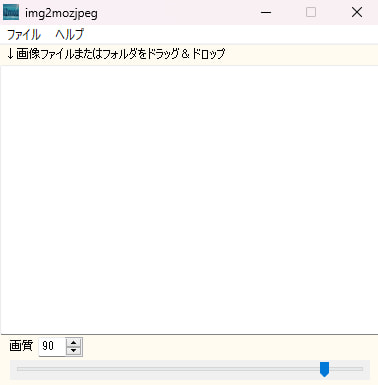

# img2mozjpeg

  

このアプリは様々な形式の画像ファイルをmozjpegによる圧縮でjpgに変換します  
既存のmozjpegはwebpやavifに入力対応しておらずローカルで一括変換したかったので作成しました  

## 使用方法
 入力ファイルはwebp、jpg、png、bmp、gif、avifに対応確認済みです  
出力先は画像を入力した同じフォルダのjpgフォルダになります  
複数ファイルドラッグ＆ドロップ対応しています  
注意点として画像ファイル以外の全ての拡張子のファイルも処理するのでフォルダをドラッグ＆ドロップする際は画像のみのフォルダにしてください（カスタム拡張子など多くの形式に対応するため）   
